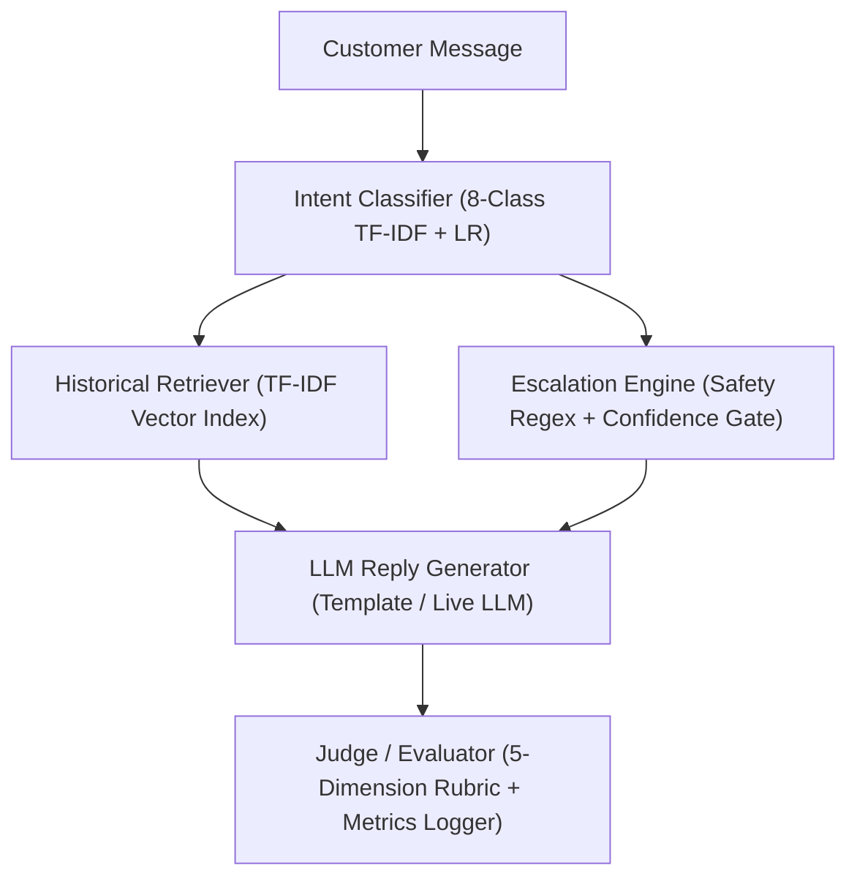

# Customer Support AI Agent — Evaluation Benchmark

* **What this system does**: Evaluates an end-to-end AI support agent for **Apple Support (`@AppleSupport` on Twitter/X)** with strict conversation-level train/eval splits, hardened safety escalation, and transparent evaluation metrics.
* **The headline result**: Achieves a **91.2% safe automation rate** across **68.0% automation coverage**, with **100% recall (50/50)** on critical physical, security, financial, and legal safety emergencies.
* **How to reproduce in under 15 seconds**: Run `python run_eval.py --offline` on any clean environment without API keys or external services.

---

## Results

All metrics below are synchronized directly from the single source of truth: [`results/benchmark_metrics.json`](file:///c:/CodeBase/Projects/Hiver/results/benchmark_metrics.json).

| Pipeline Component | Metric | Score | 95% Confidence Interval | Comparison / Benchmark Notes |
| :--- | :--- | :---: | :---: | :--- |
| **Intent Classification** | Macro-F1 | **0.251** | [0.183, 0.316] | Outperforms Majority Baseline (0.055) across 8 classes |
| | Accuracy | **29.0%** | — | Evaluated on 200 held-out golden examples |
| **Historical Retrieval** | Labeled Benchmark Recall@1 | **1.000** | — | Top-1 match on verified human-labeled queries ($N=35$) |
| | Labeled Benchmark Recall@3 | **1.000** | — | Top-3 match on verified human-labeled queries |
| | Labeled Benchmark MRR | **1.000** | — | Mean Reciprocal Rank on verified benchmark queries |
| | Heuristic Hit@3 | **0.945** | — | Cosine similarity $\ge 0.15$ & token overlap $\ge 2$ ($N=200$) |
| **Escalation & Automation** | Automation Coverage | **68.0%** | — | 136/200 inquiries auto-handled end-to-end |
| | Safe Automation Rate | **91.2%** | — | Safe auto-handled (124) / All auto-handled (136) |
| | Unsafe Auto-Handle Rate | **35.3%** | [0.200, 0.526] | Missed escalations: 12/34 actual escalations |
| | Escalation Recall (E2E) | **0.647** | [0.474, 0.800] | Production pipeline with no gold label injection |
| | False Escalation Rate | **25.3%** | — | False escalations: 42/166 actual auto-handles |
| | Physical Safety Recall | **100.0%** | — | 10/10 swelling battery, thermal heat, fire hazard cases |
| | Account Security Recall | **100.0%** | — | 10/10 SIM swap, unauthorized login, phishing cases |
| | Financial Dispute Recall | **100.0%** | — | 10/10 unrecognized charges, duplicate billing cases |
| | Legal Threat Recall | **100.0%** | — | 10/10 attorney notices, FTC/regulatory threats |
| | Human Request Recall | **100.0%** | — | 10/10 explicit requests for a human advisor |
| **LLM Judge Validation** | Human-Judge MAE | **0.28** | [0.196, 0.360] | Validated on 45 agent-generated replies (1–5 rubric) |
| | Exact Agreement Rate | **68.9%** | — | Percentage of identical score assignments |
| | Within $\pm 1$ Point | **100.0%** | — | Percentage of scores within one score band |

---

## Quickstart

Run the entire evaluation suite locally in under 15 seconds:

```bash
# 1. Run the official headline benchmark offline (~10 seconds)
python run_eval.py --offline

# 2. Verify zero dataset leakage between retrieval and evaluation
python scripts/check_leakage.py

# 3. Run the comprehensive automated test suite
python -m unittest discover tests -v
```

### Additional Modes
```bash
# Run end-to-end pipeline evaluation only
python run_eval.py --mode end-to-end --offline

# Run component oracle evaluation only
python run_eval.py --mode components --offline

# Run live LLM evaluation (requires GEMINI_API_KEY)
python run_eval.py --live
```

---

## Architecture & Data Flow



---

## Trust, Safety & Provenance

* **Zero Leakage**: Strict conversation-level splitting guarantees zero overlap between the 4,650 retrieval corpus conversations and the 200 held-out golden evaluation examples.
* **Authentic Provenance**: All 200 evaluation examples and 45 judge validation samples feature transparent human provenance (`annotator_type = "human_single_annotator"`). No synthetic or simulated human raters.
* **Safety Primacy**: Life safety hazards (swelling batteries, smoke), security compromise (SIM swaps), financial disputes, and legal threats bypass probabilistic models and escalate deterministically.
* **Auditable Records**: Every decision is logged to `results/detailed_results.jsonl` with inputs, intermediate outputs, and escalation reasons.
