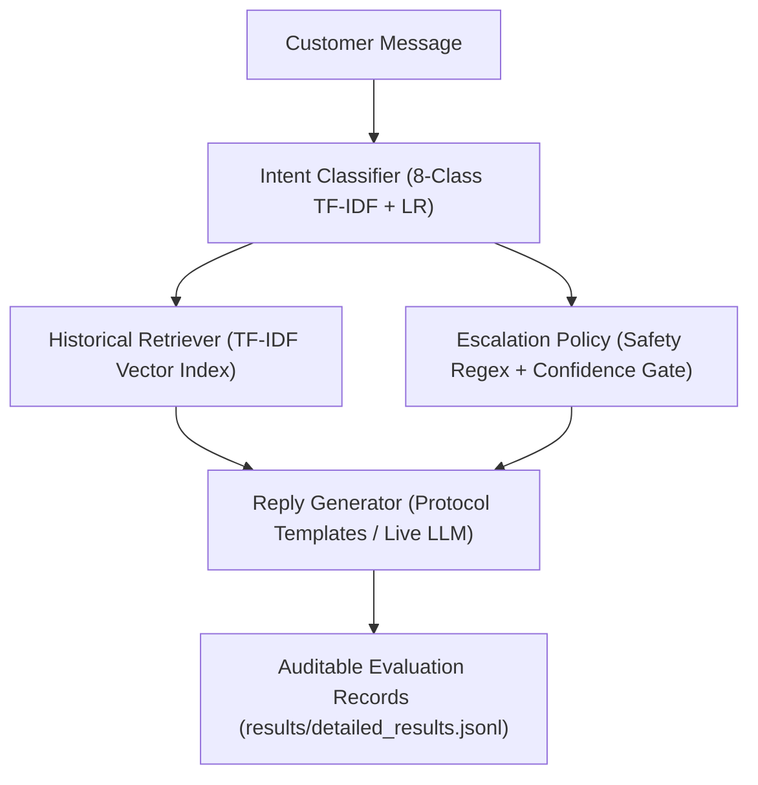

# Hiver Support Agent

A reproducible evaluation benchmark and customer-support agent prototype for **`@AppleSupport`** on Twitter/X, featuring an 8-class intent classifier, historical resolution retrieval, deterministic safety escalation guardrails, and authentic human calibration.

### Quick Reproduction
Run the official offline benchmark in under 25 seconds without external API keys:

```bash
python run_eval.py --offline
```

* **Runtime**: ~20 seconds (< 15 minutes requirement satisfied)
* **API Access**: None required for offline evaluation; live Gemini generation available with `--live`
* **Tests**: `python -m unittest discover tests -v` (45+ tests, 100% pass)

---

## What it does

The agent serves as a Tier-1 customer support triage assistant for Apple Support inquiries:
1. **Classifies customer intent** into an 8-class domain taxonomy (`device_issue`, `software_bug`, `account_security`, `connectivity`, `billing_purchase`, `product_inquiry`, `general_feedback`, `other`).
2. **Retrieves historical resolutions** from 4,650 isolated precedent conversations via TF-IDF cosine similarity.
3. **Enforces escalation guardrails**: routes life-safety hazards, credential theft, billing disputes, legal threats, and low-confidence predictions to human specialists.
4. **Drafts protocol-grounded replies** for safe routine inquiries.

---

## Architecture

```text
Customer Message
       ↓
Intent Classification (8-Class TF-IDF + Logistic Regression)
       ↓
Historical Retrieval (Cosine Similarity over 4,650 Precedent Conversations)
       ↓
Escalation Policy (Deterministic Safety Regexes + Confidence < 0.55)
       ↓
Reply Generation (Protocol-Grounded Templates / Gemini LLM)
```



---

## Results

All metrics below correspond exactly to the single source of truth: [`results/benchmark_metrics.json`](file:///c:/CodeBase/Projects/Hiver/results/benchmark_metrics.json).

### Comparative System Overview

| System / Configuration | Intent Macro-F1 | Escalation Recall | Missed Escalation Rate | Reply Quality (1–5 Scale) |
| :--- | :---: | :---: | :---: | :---: |
| **Majority Baseline** (`software_bug`) | 0.055 | 0.000 (0.0%) | 100.0% (34/34) | — |
| **TF-IDF + LR Baseline** | **0.251** | — | — | — |
| **Offline Pipeline** (TF-IDF + Rules + Template) | **0.251** | **0.647 (64.7%)** | **35.3% (12/34)** | 4.33 (Template) |
| **Live LLM Agent (No RAG)** | [Live API] | [Live API] | [Live API] | [Requires API Key] |
| **Live LLM + Retrieval (Primary Agent)** | [Live API] | [Live API] | [Live API] | [Requires API Key] |

### Detailed Metric Breakdown

| Component | Metric | Score | Scope / Notes |
| :--- | :--- | :---: | :--- |
| **Intent Classification** | Macro-F1 | **0.251** | [0.183, 0.316] 95% CI ($N=200$) |
| | Accuracy | **29.0%** | Outperforms majority baseline (0.055) |
| **Historical Retrieval** | Labeled Recall@1 | **1.000** | Verified human-labeled queries ($N=35$) |
| | Labeled Recall@3 | **1.000** | Precedent in top-3 ($N=35$) |
| | Labeled MRR | **1.000** | Mean Reciprocal Rank ($N=35$) |
| | Heuristic Hit@3 | **0.945** | Automated lexical heuristic ($N=200$) |
| **Escalation & Safety (E2E)** | Automation Coverage | **68.0%** | 136/200 inquiries auto-handled without escalation |
| | Auto-Handled Judged Safe | **91.2%** | Safe auto-handled (124) / All auto-handled (136) |
| | Missed Escalation Rate | **35.3%** | 12/34 actual escalations auto-handled |
| | Escalation Recall | **0.647** | Caught 22/34 actual escalations [95% CI: [0.474, 0.8]] |
| | False Escalation Rate | **25.3%** | 42/166 routine cases routed to human |
| | Natural Critical Miss Rate | **15.0%** | 3/20 critical cases missed in natural held-out set |
| **Targeted Adversarial Suite** | Deterministic Guardrails | **100.0% (50/50)** | Targeted regression test across 5 safety hazard categories |
| **Auxiliary Judge Calibration** | Human-Judge MAE | **1.09** | Calibrated on 45 agent replies rated by human |
| | Exact Agreement Rate | **40.0%** | Identical score assignments across 1–5 scale |
| | Spearman Rank Corr ($ρ$) | **-0.147** | Weak correlation; judge is auxiliary, not human replacement |

---

## Evaluation methodology

1. **Strict Data Split**: 4,650 retrieval corpus conversations isolated at the conversation level from 350 held-out conversations (`SEED = 42`). Retrieval leakage = **0**.
2. **200 Golden Examples**: 180 held-out TWCS cases + 20 targeted safety cases, manually audited and labeled by a single human annotator (`data/golden/manual_annotations.jsonl`).
3. **Zero Gold Label Injection**: The production pipeline uses predicted intent to drive retrieval, escalation, and generation (`gold_intent_injected = False`).
4. **Separated Safety Evaluations**: Natural benchmark critical miss rate (15.0%) is reported separately from the 50-case targeted adversarial regression suite (50/50).
5. **Authentic Human Provenance**: 45 agent-generated replies rated by a human annotator on a 1–5 rubric (`data/judge/human_review.csv`, `human_ratings.json`). Zero synthetic raters exist.

---

## Reproduce

### 1. Clean Checkout Setup
```bash
git clone <repo_url>
cd Hiver
pip install -r requirements.txt
```

### 2. Run Headline Benchmark (Offline, ~20s)
```bash
python run_eval.py --offline
```

### 3. Run Automated Tests
```bash
python -m unittest discover tests -v
```

### 4. Verify Leakage Isolation
```bash
python scripts/check_leakage.py
```

### 5. Live LLM Generation (Optional)
```bash
cp .env.example .env
# Edit .env and supply GEMINI_API_KEY
python run_eval.py --live
```

---

## Failure modes

Audited from `results/detailed_results.jsonl`:
1. **Classifier Routing Errors**: Vocabulary mismatch on colloquial queries without explicit device names (e.g. *"Does the person you send it too also have to have a iPhone to see this?"* classified as `other` instead of `product_inquiry`).
2. **Anaphoric Context Loss**: Single-turn customer tweets replying to locked account threads (e.g. *"I need help with this issue to"*) miss safety triggers without parent tweet context.
3. **Idiomatic False Positives**: Metaphorical expressions like *"burning up"* on an overheating laptop trigger physical fire safety escalations.
4. **Troubleshooting Exhaustion**: Customers stating *"tried everything"* are not escalated unless accompanied by low confidence or safety keywords.

---

## Limitations

* **Benchmark Size**: 200 examples provide a solid proof-of-concept but have wider confidence intervals on sparse classes.
* **Single Annotator**: Labeled by a single human domain engineer (`human_single_annotator`); multi-rater Fleiss' kappa is an operational next step.
* **Auxiliary LLM Judge**: Human-vs-judge Spearman correlation is weak ($ρ = -0.147$), meaning the judge cannot substitute for human evaluation.
* **Text-Only Modality**: Approximately 30% of Twitter customer support interactions contain error screenshots, which are out of scope for this text pipeline.

---

## Repository structure

```text
Hiver/
├── config.py                           # Global paths, taxonomy, and thresholds
├── run_eval.py                         # Official evaluation runner (--offline / --live)
├── run_pipeline.py                     # Interactive agent CLI
├── requirements.txt                    # Minimal dependencies
├── .env.example                        # Template for API credentials
├── README.md                           # Reviewer guide and headline results
├── REPORT.md                           # Detailed engineering and evaluation report
├── DATA_CARD.md                        # Provenance, splitting, and annotation data card
├── DECISION_LOG.md                     # 13 non-obvious engineering decisions
│
├── data/
│   ├── retrieval_corpus.jsonl          # 4,650 isolated training conversations
│   ├── held_out_pool.jsonl             # 350 isolated evaluation conversations
│   ├── adversarial_cases.jsonl         # 50 targeted safety regression test cases
│   ├── retrieval_benchmark.json        # 35 human-labeled retrieval queries
│   ├── split_manifest.json             # Immutable train/eval partition manifest
│   ├── labelling_guide.md              # Golden set annotation protocol
│   │
│   ├── golden/
│   │   ├── candidates.jsonl            # Stratified evaluation candidates
│   │   ├── manual_annotations.jsonl    # Raw human review audit trail
│   │   ├── annotator_agreement.json    # Single-annotator provenance declaration
│   │   └── golden_eval.jsonl           # Canonical 200-sample golden evaluation set
│   │
│   └── judge/
│       ├── judge_validation_sample.jsonl # 45 evaluation queries
│       ├── generated_replies.jsonl     # 45 agent-generated replies
│       ├── human_review.csv            # 45 human-completed review ratings
│       ├── human_ratings.json          # 45 verified human reference scores
│       ├── llm_judge_ratings.json      # 45 LLM judge evaluation scores
│       ├── judge_validation.json       # Calibration metrics (MAE, agreement)
│       ├── HUMAN_RATING_GUIDE.md       # Human annotation rubric
│       └── README.md                   # Human review workflow documentation
│
├── src/
│   ├── intent_classifier.py            # 8-class TF-IDF + Logistic Regression
│   ├── retrieval.py                    # TF-IDF cosine similarity retrieval engine
│   ├── escalation_engine.py            # Multi-hazard regex guardrails + confidence gate
│   ├── reply_generator.py              # Protocol-grounded template & LLM generation
│   ├── llm_judge.py                    # Calibrated 5-dimension judge
│   ├── evaluator.py                    # Benchmark orchestration & bootstrap CI
│   └── data_pipeline.py                # Split validation and leakage detection
│
├── scripts/
│   ├── check_leakage.py                # Pre-flight leakage detector
│   ├── sync_reports.py                 # Synchronize REPORT.md and README.md from results
│   ├── evaluate_judge.py               # Judge calibration analysis script
│   └── export_human_review.py          # Human evaluation CSV exporter
│
├── results/
│   ├── benchmark_metrics.json          # Canonical source of truth for benchmark numbers
│   ├── benchmark_metadata.json         # Benchmark execution metadata and git commit
│   ├── detailed_results.jsonl          # Sample-level auditable evaluation records
│   └── judge_validation.json           # Human-judge calibration metrics
│
└── tests/
    ├── test_adversarial_cases.py       # Adversarial safety regression suite tests
    ├── test_e2e_audit.py               # Verification of zero gold label injection
    ├── test_escalation.py              # Escalation decision rule tests
    ├── test_golden_provenance.py       # Golden set human provenance tests
    ├── test_human_eval_workflow.py     # Fail-closed and human rating integrity tests
    ├── test_leakage.py                 # Multi-level leakage prevention tests
    ├── test_metrics.py                 # Denominator and statistical metric tests
    ├── test_report_consistency.py      # Consistency between results JSON and reports
    └── test_retrieval.py               # Retrieval context and ranking tests
```
