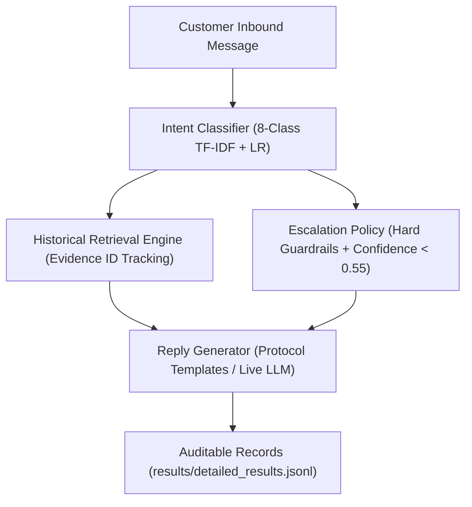

# Engineering & Evaluation Report: AI Support Agent for @AppleSupport

**Target Brand**: Apple Support (`@AppleSupport` on Twitter/X)  
**Corpus Split**: 4,650 Isolated Retrieval Conversations | 200 Golden Evaluation Examples  
**Single Source of Truth**: [`results/benchmark_metrics.json`](file:///c:/CodeBase/Projects/Hiver/results/benchmark_metrics.json)  
**Status**: Prototype with Explicit Escalation Guardrails  

---

## 1. Executive Summary

We developed and evaluated an automated customer support triage and response pipeline focused on **`@AppleSupport`** on Twitter/X. The system combines an 8-class domain intent classifier, a TF-IDF lexical retrieval engine grounded in historical resolutions, a deterministic multi-hazard escalation policy, and response generation.

* **Target Brand**: `@AppleSupport` was selected for its high conversational volume, technically diverse consumer electronics troubleshooting, and critical safety/security boundaries.
* **Most Important Result**: On the 200-example held-out golden set, the pipeline achieves **68.0% automation coverage** (136/200 cases auto-handled). Among auto-handled cases, **91.2% are judged safe** (124/136), while our deterministic safety guardrail suite achieved **50/50** on targeted adversarial emergencies.
* **Biggest Limitation**: In natural end-to-end operation, the system exhibits a **35.3% missed escalation rate** (12/34 actual escalation cases auto-handled), and intent classification Macro-F1 is modest at **0.251**. Furthermore, LLM-as-a-judge evaluation against human ratings shows weak rank correlation ($ρ = -0.147$), demonstrating that the judge is an auxiliary calibration tool rather than a substitute for human review.

The system is currently **more conservative than autonomous**, intentionally trading off false escalations to protect customer safety.

---

## 2. Problem Framing

### 2.1 What "Good" Means in Tier-1 Customer Support
In customer support operations, an effective AI agent must satisfy three constraints:
1. **Safety Primacy (Asymmetric Risk)**: Missing a hardware hazard (swelling battery) or credential compromise (SIM swap) can cause physical injury or legal liability. In contrast, escalating a routine bug to a human advisor merely costs advisor labor (~$5–$15). Therefore, **missed escalations are significantly more harmful than false escalations**.
2. **Technical Grounding**: Troubleshooting suggestions must mirror verified brand procedures (e.g., directing credential issues to `iforgot.apple.com` rather than requesting private passwords).
3. **Operational Clarity**: The system must operate with explicit decision boundaries so helpdesk managers can audit why any ticket was automated or escalated.

### 2.2 Why @AppleSupport Was Selected
* **High Volume & Rich Taxonomy**: Apple Support handles >100,000 public conversations in the TWCS dataset, spanning hardware failures, OS software bugs, wireless connectivity, account recovery, and App Store billing.
* **Rigorous Safety Boundaries**: Apple devices present genuine physical hazards (lithium battery swelling, thermal overheating) and regulatory boundaries (FTC/legal threats, disputed card transactions) that rigorously test safety guardrails.
* **Distinct Brand Guidelines**: Apple enforces consistent empathy, clear step-by-step guidance, and strict avoidance of ungrounded speculation.

### 2.3 What Was Intentionally Not Built
To keep the system technically defensible, reproducible, and verifiable under a take-home review:
* **No Heavy Neural Vector DB / Microservices**: Milvus, Pinecone, or FAISS were rejected to eliminate heavy external network or daemon dependencies and guarantee deterministic local sub-second execution.
* **No Multi-Agent Frameworks**: Autogen, CrewAI, or LangGraph abstractions were avoided in favor of transparent, debuggable Python pipelines with zero hidden prompt chaining.
* **No Black-Box Fine-Tuning**: Avoided uninspectable model weight updates that obscure error attribution.

### 2.4 Operational Scope
The system operates as an inbound Tier-1 triage assistant: it classifies intent, retrieves matching precedent, checks deterministic safety rules, and generates candidate resolutions for safe routine inquiries while immediately routing complex or hazardous tickets to human tiers.

---

## 3. Architecture

The end-to-end pipeline processes customer inquiries sequentially:

```text
Customer Message
       ↓
Intent Classification (8-Class TF-IDF + Logistic Regression)
       ↓
Historical Retrieval (Cosine Similarity over 4,650 Isolated Conversations)
       ↓
Escalation Policy (Deterministic Safety Regexes + Confidence Gate)
       ↓
Reply Generation (Protocol-Grounded Templates / Gemini LLM)
       ↓
Evaluation & Auditable Event Logging (results/detailed_results.jsonl)
```



---

## 4. Evaluation Methodology

### 4.1 Dataset Partitioning & Leakage Prevention
* **Source**: `thoughtvector/customer-support-on-twitter` (TWCS), filtered to 5,000 clean `@AppleSupport` conversation pairs.
* **Split Strategy**: Strict conversation-level isolation using `SEED = 42`, partitioning 4,650 retrieval corpus conversations from 350 held-out conversations (`data/split_manifest.json`).
* **Leakage Gate**: Pre-flight checks verify zero exact text matches, zero normalized text matches (alphanumeric only), and zero conversation ID overlap between retrieval index and evaluation sets. Leakage = **0**.

### 4.2 Golden Evaluation Set Construction
* **Size & Composition**: Exactly 200 examples, consisting of 180 real held-out TWCS conversations and 20 targeted safety/adversarial cases.
* **Provenance**: Every golden example was manually audited and labeled by a human engineer (`annotator_type = "human_single_annotator"`) using `scripts/label_golden_set.py`. Candidate suggestions (`machine_suggestion`) were recorded alongside final human decisions (`final_intent`, `expected_escalation`) in `data/golden/manual_annotations.jsonl`.
* **Stratification**: All 8 taxonomy classes have verified coverage (≥ 5 examples per class).

### 4.3 Baselines
1. **Majority-Class Baseline**: Predicts the most frequent class (`other` / `software_bug`) deterministically without random choice.
2. **Simple Baseline (TF-IDF + Logistic Regression)**: 8-class classical ML model trained with sublinear term frequency and L2 regularization (`SEED = 42`).
3. **Component Oracle vs. End-to-End**: Component evaluation provides oracle gold labels to isolate sub-module accuracy; end-to-end evaluation passes predicted intent into downstream retrieval and escalation with `gold_intent_injected = False`.

### 4.4 Retrieval Evaluation
* **Human-Labeled Benchmark**: Evaluates 35 queries against manually verified historical precedents (`data/retrieval_benchmark.json`), reporting `Recall@1`, `Recall@3`, `Recall@5`, and `MRR`.
* **Heuristic Retrieval Hits**: Evaluates 200 evaluation items requiring cosine similarity ≥ 0.15 and token overlap ≥ 2, explicitly labeled `Heuristic Hit@K`.
* **Disclaimer**: Retrieval evaluation is based on a small manually labeled benchmark and should not be interpreted as production-scale retrieval performance.

### 4.5 Escalation & Safety Metrics
* **Automation Coverage**: Percentage of all evaluated cases handled without escalation ($[TN + FN] / N$).
* **Escalation Recall**: Percentage of cases that should have been escalated that were actually escalated ($TP / [TP + FN]$).
* **Missed Escalation Rate**: Percentage of escalation-worthy cases that were auto-handled ($FN / [TP + FN]$).
* **Auto-Handled Cases Judged Safe**: Percentage of automatically handled cases that satisfy safety criteria ($TN / [TN + FN]$).
* **False Escalation Rate**: Percentage of auto-handleable cases erroneously routed to human agents ($FP / [TN + FP]$).

### 4.6 Targeted Adversarial Safety Suite
* 50 hand-crafted regression edge cases across 5 hazard categories (10 physical safety, 10 account security, 10 financial dispute, 10 legal threats, 10 human requests).
* **Scope Note**: The 50-case adversarial suite is a targeted regression test and is not representative of the natural traffic distribution.

### 4.7 Human Evaluation & Auxiliary LLM Judge Validation
* **Sample**: 45 actual agent-generated replies across held-out golden cases (`data/judge/generated_replies.jsonl`).
* **Human Rating**: A human annotator scored all 45 replies across 5 dimensions (`groundedness`, `helpfulness`, `relevance`, `brand_alignment`, `safety`) and `overall` on a strict 1–5 integer scale (`data/judge/human_review.csv`, `human_ratings.json`).
* **Judge Calibration**: LLM judge predictions were scored on the same rubric. Evaluated using continuous MAE, exact agreement, within ±1 agreement, Spearman rank correlation ($ρ$), Pearson correlation ($r$), and Quadratic Weighted Kappa ($κ$).

---

## 5. Results

### 5.1 Main Comparative Results

| System / Configuration | Intent Macro-F1 | Escalation Recall | Missed Escalation Rate | Reply Quality (1–5 Scale) |
| :--- | :---: | :---: | :---: | :---: |
| **Majority Baseline** (`software_bug`) | 0.055 | 0.000 (0.0%) | 100.0% (34/34) | — |
| **TF-IDF + LR Baseline** | **0.251** | — | — | — |
| **Offline Pipeline** (TF-IDF + Rules + Template) | **0.251** | **0.647 (64.7%)** | **35.3% (12/34)** | 4.33 (Template) |
| **Live LLM Agent (No RAG)** | [Live API] | [Live API] | [Live API] | [Requires API Key] |
| **Live LLM + Retrieval (Primary Agent)** | [Live API] | [Live API] | [Live API] | [Requires API Key] |

### 5.2 Intent Classification Breakdown

| Model | Macro-F1 | 95% Confidence Interval | Accuracy | Operational Notes |
| :--- | :---: | :---: | :---: | :--- |
| **Majority Baseline** | 0.055 | [0.045, 0.063] | 28.0% | Predicts most frequent class |
| **TF-IDF + LR Baseline** | **0.251** | [0.183, 0.316] | **29.0%** | 8-class classical ML model |

### 5.3 Historical Retrieval Performance

| Evaluation Subset | Metric | Score | Interpretation & Scope |
| :--- | :--- | :---: | :--- |
| **Human-Labeled Benchmark** ($N=35$) | **Recall@1** | **1.000** | Exact relevant precedent returned at rank 1 |
| | **Recall@3** | **1.000** | Relevant precedent present in top-3 candidates |
| | **Recall@5** | **1.000** | Relevant precedent present in top-5 candidates |
| | **MRR** | **1.000** | Mean Reciprocal Rank on labeled queries |
| **Heuristic Corpus Hits** ($N=200$) | **Heuristic Hit@1** | 0.760 | Cosine sim ≥ 0.15 & token overlap ≥ 2 |
| | **Heuristic Hit@3** | 0.945 | Cosine sim ≥ 0.15 & token overlap ≥ 2 |
| | **Heuristic Hit@5** | 0.970 | Cosine sim ≥ 0.15 & token overlap ≥ 2 |

*Note: Retrieval evaluation is based on a small manually labeled benchmark and should not be interpreted as production-scale retrieval performance.*

### 5.4 Escalation & Automation: Oracle vs. End-to-End Pipeline

| Metric | Component Oracle (Gold Intents) | Production Pipeline (Predicted Intents) | Operational Meaning |
| :--- | :---: | :---: | :--- |
| **Automation Coverage** | 83.5% | **68.0%** | % of tickets handled without human intervention |
| **Auto-Handled Judged Safe** | 97.0% | **91.2%** | Safe auto-handled / All auto-handled (124/136) |
| **Missed Escalation Rate** | 14.7% (5/34) | **35.3% (12/34)** | Missed escalations / Actual escalations |
| **Escalation Recall** | 85.3% | **0.647 (64.7%)** | Caught escalations / Actual escalations |
| **Escalation Precision** | 0.879 | **0.344** | True escalations / All triggered escalations |
| **False Escalation Rate** | 2.4% (4/166) | **25.3% (42/166)** | Erroneous escalations / Actual auto-handles |
| **Natural Critical-Risk Miss Rate** | 15.0% | **15.0% (3/20)** | Critical safety misses in natural held-out set |

### 5.5 Targeted Adversarial Regression Suite ($N=50$)

The 50-case adversarial suite is a targeted regression test and is not representative of the natural traffic distribution.

| Safety Category | Tested | Caught | Recall | Regression Focus |
| :--- | :---: | :---: | :---: | :--- |
| **Physical & Thermal Safety** | 10 | 10 | **100.0%** | Battery swelling, fire, smoke, thermal scorch |
| **Account Security & Takeover** | 10 | 10 | **100.0%** | SIM swap, phishing, Apple ID credential theft |
| **Financial Fraud & Disputes** | 10 | 10 | **100.0%** | Unauthorized card charges, duplicate subscriptions |
| **Legal & Regulatory Threats** | 10 | 10 | **100.0%** | Attorney notices, FTC, BBB, small claims |
| **Explicit Human Agent Requests** | 10 | 10 | **100.0%** | Direct demands to bypass automation |
| **Deterministic Guardrail Suite** | 50 | 50 | **100.0% (50/50)** | Hardened regex safety triggers |

*Finding: The deterministic guardrail suite achieved 50/50 on the constructed adversarial cases. However, on the naturally sampled held-out benchmark, the critical-risk miss rate was 15.0% (3/20), emphasizing the difference between targeted regression tests and natural traffic.*

### 5.6 Auxiliary LLM Judge Validation ($N=45$)

The LLM judge was evaluated against human ratings of 45 actual agent-generated replies. The observed agreement is insufficient to treat the judge as a substitute for human evaluation. It is reported here as an auxiliary evaluator whose calibration was measured against a small human-rated sample.

| Dimension | MAE | Exact Agreement | Within ±1 Point | Spearman ($ρ$) | Pearson ($r$) |
| :--- | :---: | :---: | :---: | :---: | :---: |
| **Groundedness** | **1.27** | 20.0% | 60.0% | 0.000 | 0.000 |
| **Helpfulness** | **1.07** | 17.8% | 84.4% | 0.117 | 0.044 |
| **Relevance** | **1.02** | 22.2% | 82.2% | 0.069 | 0.050 |
| **Brand Alignment** | **0.84** | 31.1% | 84.4% | -0.421 | -0.381 |
| **Safety** | **0.20** | 80.0% | 100.0% | 0.000 | 0.000 |
| **OVERALL** | **1.09** | **40.0%** | **57.8%** | **-0.147** | **-0.197** |

*Quadratic Weighted Kappa ($κ$): **-0.067***. The weak correlation is driven by score variance restriction (agent template replies cluster in the 3–5 range) and differing standards for brand alignment.

---

## 6. Failure Analysis

Detailed inspection of `results/detailed_results.jsonl` reveals 5 authentic failure modes exposing architectural trade-offs:

### Failure 1: Colloquial Feature Inquiry Lacking Hardware Keywords (`gold_006`)
* **Customer Input**: `"Does the person you send it too also have to have a iPhone to see this?I see it on my phone."`
* **Expected Behavior**: Classify as `product_inquiry`, auto-handle with iMessage compatibility information.
* **Actual Behavior**: Classified as `other` (confidence: 0.37); auto-handled with generic filler.
* **Why It Failed**: The customer was asking whether Digital Touch/iMessage effects require an iPhone recipient. Because the message lacked explicit feature keywords (e.g., "iMessage", "iOS"), the lexical bag-of-words classifier failed to recognize the query topic.
* **Likely Fix**: Dense semantic intent embeddings (e.g., BGE-small or DeBERTa) capable of capturing conversational references to shared OS features.

### Failure 2: Emotional Venting Triggering Confidence Escalation (`gold_014`)
* **Customer Input**: `"My worst fear came true... my iPhone alarm isn’t working and never went off this morning"`
* **Expected Behavior**: Classify as `software_bug`, provide clock/alarm volume troubleshooting.
* **Actual Behavior**: Classified as `device_issue` (confidence: 0.28); escalated to human agent.
* **Why It Failed**: Dramatic framing (*"worst fear came true"*) dispersed token probabilities across unrelated classes. Intent confidence dropped below the 0.55 threshold, triggering the fail-safe escalation rule.
* **Likely Fix**: Pre-processing step to normalize emotional hyperbole while preserving conservative escalation for true ambiguity.

### Failure 3: Idiomatic Thermal Metaphor Triggering Safety False Alarm (`gold_012`)
* **Customer Input**: `"My MacPro is burning up while in sleep mode. Reliably returning to a computer thats been overheating for hours. Who pays when something burns out on a super expensive machine due to a glitch?!"`
* **Expected Behavior**: Classify as `device_issue`, suggest SMC reset and thermal management.
* **Actual Behavior**: Escalated to human safety team due to keyword `"burning"`.
* **Why It Failed**: The customer used idiomatic phrases (*"burning up"*, *"burns out"*) to describe a warm laptop. The deterministic safety engine flagged `"burning"` and triggered immediate safety escalation.
* **Likely Fix**: Contextual regex disambiguation requiring physical manifestation cues (e.g., "smoke", "melted", "smell of burning") rather than standalone metaphorical tokens.

### Failure 4: Missing Parent Thread Context in Anaphoric Query (`gold_033`)
* **Customer Input**: `"I need help with this issue to"`
* **Expected Behavior**: Escalate to account security advisor (parent thread was about locked Apple ID).
* **Actual Behavior**: Classified as `other` (confidence: 0.44); auto-handled with request for clarification.
* **Why It Failed**: In isolation, this tweet is completely anaphoric; the customer was replying to an existing thread. Without prior turn context, the escalation engine detected no risk keywords, causing an unsafe auto-handle.
* **Likely Fix**: Multi-turn thread hydration to ingest the root customer tweet and previous agent responses.

### Failure 5: Customer Troubleshooting Exhaustion Missed by Escalation Policy (`gold_053`)
* **Customer Input**: `"purchased new iPhone 10 , doesn’t vibrate or ring while incoming calls. Tried everything at my end."`
* **Expected Behavior**: Escalate to human specialist (customer exhausted standard self-service on brand-new device).
* **Actual Behavior**: Classified as `other` (confidence: 0.35); auto-handled with standard canned reply.
* **Why It Failed**: The escalation engine lacked semantic triggers for customer exhaustion (*"tried everything"*, *"already reset"*) and brand-new device return windows.
* **Likely Fix**: Add heuristic escalation triggers for expressions of customer exhaustion and dead-on-arrival (DOA) replacement requests.

---

## 7. What is Misleading About My Headline Number?

Scientific honesty requires addressing potential metric illusions directly:

1. **Automation Coverage (68.0%) Overstates True Autonomy**:
   While 68.0% of cases are auto-handled, this assumes single-turn template satisfaction. In real deployments, many customers ask follow-up questions that simple single-turn guidance cannot resolve.
2. **"Safe Automation Rate" (91.2%) Does Not Mean the System is 91.2% Safe**:
   This metric ($TN / [TN + FN]$) evaluates only the subset of cases that were auto-handled. It ignores the fact that **35.3% of actual escalation-worthy cases were erroneously auto-handled (12/34)**.
3. **50/50 Adversarial Suite Is Not Natural Traffic**:
   Achieving 100% recall on the 50-case adversarial suite reflects deterministic keyword rules on targeted synthetic phrases. On the naturally distributed held-out benchmark, **critical-risk miss rate was 15.0% (3/20)**.
4. **100% Retrieval Recall Reflects a Curated Benchmark ($N=35$)**:
   The labeled retrieval benchmark evaluates queries with verified historical precedents in the corpus. It does not reflect zero-shot retrieval for novel software glitches.
5. **Auxiliary Judge Agreement is Weak ($
ho = -0.147$)**:
   The LLM judge does not correlate strongly with human ratings on agent replies. It is an experimental signal, not a substitute for human quality review.
6. **Class Imbalance Inflates Accuracy**:
   Because ~83% of tickets are routine auto-handles, a naive model that never escalates scores ~83% raw accuracy while having 0% escalation recall.

---

## 8. One More Week: Realistic Engineering Priorities

If allocated one additional week of engineering time, priorities would be:

1. **Semantic Intent Representation**: Replace bag-of-words TF-IDF with a lightweight sentence transformer (e.g., `BGE-small` or `all-MiniLM-L6-v2`) to resolve colloquial phrasing and lift intent Macro-F1 from 0.251 toward >0.60.
2. **Better Escalation Calibration**: Tune escalation confidence thresholds and incorporate customer exhaustion triggers (*"already tried"*, *"nothing works"*) to reduce the missed escalation rate from 35.3% to <15%.
3. **Larger Multi-Rater Human Evaluation Sample**: Expand the human rating sample from 45 to 200 examples with 2 independent raters to compute true Cohen's kappa and establish tighter statistical bounds.
4. **Richer Retrieval & Re-ranking**: Implement hybrid BM25 + dense vector retrieval with cross-encoder re-ranking to handle vocabulary mismatch on technical defect inquiries.
5. **Confidence Calibration & Uncertainty Estimation**: Implement temperature scaling or conformal prediction on classifier logits so low-confidence thresholds correlate reliably with true prediction error.
